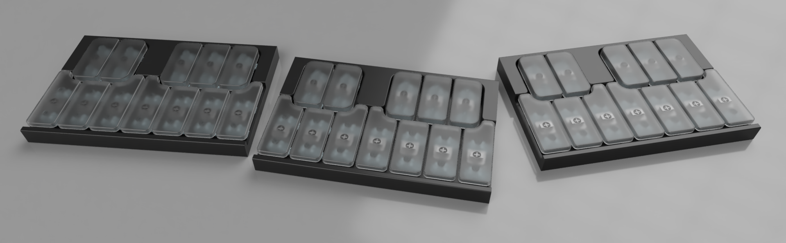
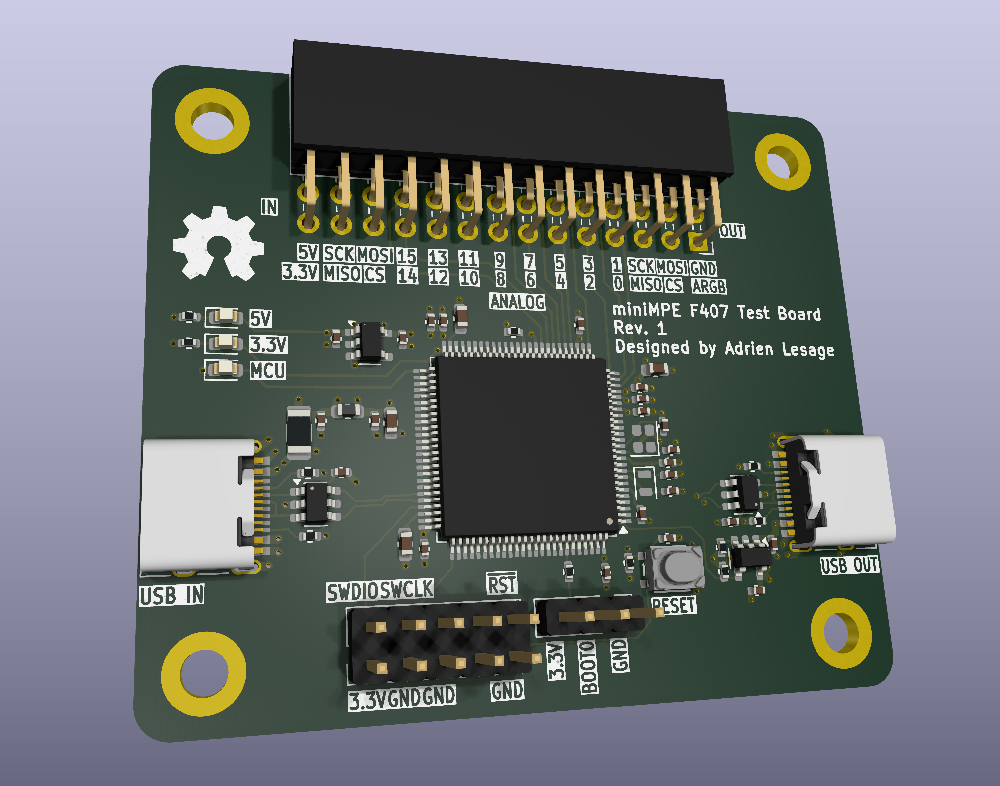
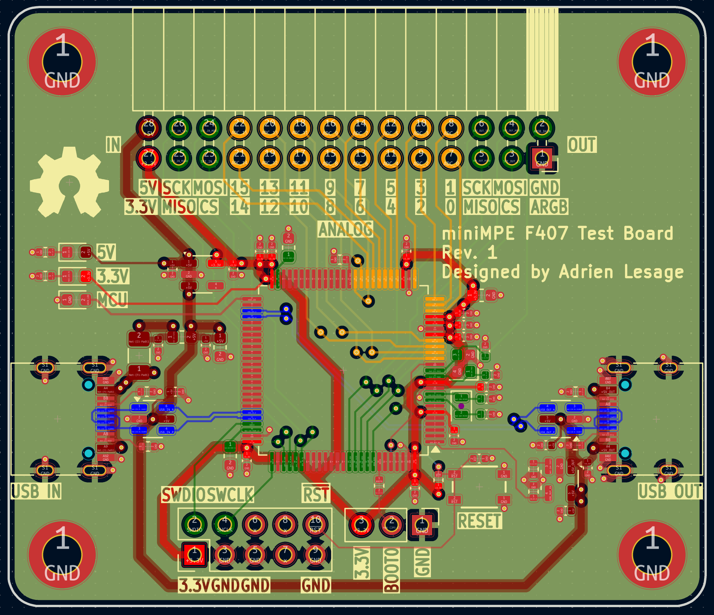

# miniMPE

An ultra-compact expressive octave-sectioned MIDI keyboard
## Idea

Originally inspired by the KORG nanoKeys line of ultra-compact MIDI keyboards, I wanted to design an alternative, with a few improvements:

- Standard key width
- Velocity sensitivity
    - The nanoKeys is not velocity sensitive, as it uses rubber-dome-like keys.
- RGB lighting for scale highlighting and pretty effects
- Daisy-chainable design, to go beyond a 2 octave design
    - This will likely be done using magnetic pogo pin connectors, for an easy and durable connection.
- Open Source :)
## Sub-projects
### MCU Test Board
This is a 4-layer test PCB designed to test one of the chosen MCU picks, alongside its dual USB peripherals, which this project might utilize.

#### Specs
- STM32F407 MCU
    - Dual USB peripherals
- IO header with dual SPI and 16 analog channels
- Dual USB ports
    - Output is protected against over-voltage
- Impedance matched USB and digital signals
- 4-layer design (Signal - Power/Gnd - Gnd - Signal)
